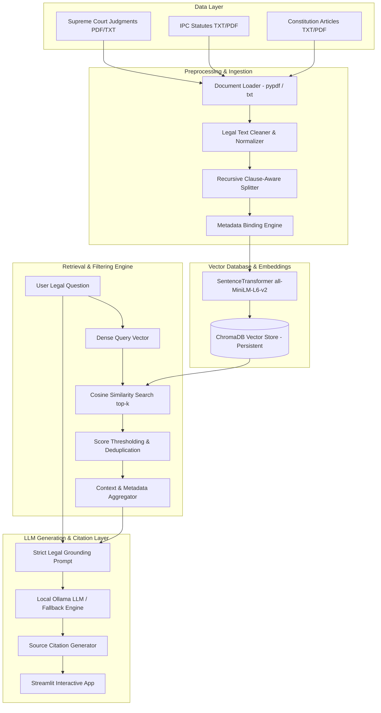

# ⚖️ Indian Legal RAG System — Grounded Legal AI Research Platform

[](https://www.python.org/)
[](https://www.langchain.com/)
[](https://www.trychroma.com/)
[](https://streamlit.io/)
[](https://opensource.org/licenses/MIT)

> **A production-ready, domain-specific Retrieval-Augmented Generation (RAG) system built from scratch to assist legal researchers, advocates, and law students in querying authentic Indian legal documents (Supreme Court Judgments, Indian Penal Code Statutes, and Constitutional Provisions) with zero-hallucination guarantees and verifiable source citations.**

---

## 📌 1. Project Overview & Problem Statement

### Problem Statement
Indian legal research requires searching through vast repositories of case law judgments, statutory provisions, and constitutional amendments. Standard commercial Large Language Models (LLMs) suffer from critical limitations when applied to legal domain tasks:
1. **Hallucination of Case Law:** Generating non-existent precedents, erroneous section numbers, or fake legal citations.
2. **Outdated Knowledge & Lack of Grounding:** Inability to cite specific pages, sections, or authentic court documents.
3. **Data Privacy Risks:** Transmitting confidential legal files to external third-party APIs.

### Project Objective
The **Indian Legal RAG System** solves these challenges by implementing an offline-first RAG pipeline that enforces strict context-grounding. Every synthesized answer is derived **exclusively** from retrieved legal documents, accompanied by verifiable citations pointing back to exact document titles, court authorities, page numbers, and verbatim excerpts.

---

## 🏗️ 2. End-to-End System Architecture



---

## 🛠️ 3. Technology Stack & Design Decisions

| Layer | Component | Choice | Justification |
| :--- | :--- | :--- | :--- |
| **Language** | Python 3.10 | Core Language | Industry standard for AI/ML development and RAG orchestration |
| **Orchestration** | LangChain & Splitters | Framework | Standardized text splitting, metadata handling, and RAG components |
| **Vector DB** | ChromaDB Persistent | Storage | Embedded, zero-config vector store with disk persistence & fast querying |
| **Embeddings** | `all-MiniLM-L6-v2` | Embedding Model | 384-dimensional dense vectors; CPU-friendly, fast, 100% free local execution |
| **Local LLM** | Ollama (`llama3.2:1b`) | LLM Runtime | Private local inference without third-party API keys or cloud costs |
| **Frontend** | Streamlit | Web Interface | Polished, responsive web dashboard tailored for AI/ML live portfolio demos |
| **PDF Extraction**| `pypdf` | Document Parser | Native Python PDF text and metadata extractor with scanned PDF safeguards |
| **Testing** | `pytest` | Testing | Modular unit & integration test suite |

---

## 📁 4. Repository Directory Structure

```
legal-rag-system/
├── app.py                      # Streamlit Interactive User Interface
├── config.py                   # Centralized Configuration & Environment Defaults
├── requirements.txt            # Pinned Project Dependencies
├── .env.example                # Environment Variable Template
├── .gitignore                  # Git Rule Definitions
├── README.md                   # Complete Documentation & Interview Guide
├── LICENSE                     # MIT Open-Source License
├── data/
│   ├── raw/                    # User-uploaded raw legal files
│   ├── processed/              # Evaluation results JSON output
│   └── sample/                 # Sample authentic Indian legal documents
│       ├── supreme_court_kesavananda_1973.txt
│       ├── supreme_court_puttaswamy_privacy.txt
│       ├── ipc_section_300_murder.txt
│       └── constitution_article_21.txt
├── storage/                    # Persistent ChromaDB storage directory
│   └── .gitkeep
├── scripts/
│   ├── ingest_documents.py     # Standalone CLI ingestion script
│   ├── check_environment.py    # System & dependency verification utility
│   └── evaluate_rag.py         # Retrieval Precision/Recall/MRR benchmark
├── src/
│   ├── __init__.py
│   ├── document_loader.py      # PDF/TXT loader with scanned PDF detection
│   ├── text_processor.py       # Legal cleaner & clause-aware text splitter
│   ├── embeddings.py           # Local SentenceTransformer embeddings manager
│   ├── vector_store.py         # Persistent ChromaDB store & deduplication
│   ├── retriever.py            # Similarity search, thresholding & deduplication
│   ├── llm_service.py          # Local Ollama client & offline fallback engine
│   ├── prompt_templates.py     # Grounding prompts preventing hallucinations
│   ├── citation_formatter.py   # Traceable legal citation renderer
│   └── rag_pipeline.py         # Master pipeline orchestrator
├── tests/
│   ├── test_document_loader.py
│   ├── test_text_processor.py
│   ├── test_vector_store.py
│   ├── test_retriever.py
│   ├── test_citations.py
│   └── test_rag_pipeline.py
└── docs/
    └── architecture.md         # Deep-dive architecture reference & flowcharts
```

---

## 🚀 5. Quick Start Guide

### Step 1: Clone Repository & Setup Virtual Environment

**On Windows (PowerShell):**
```powershell
git clone https://github.com/yashtripya/legal-rag-system.git
cd legal-rag-system
python -m venv venv
.\venv\Scripts\Activate.ps1
```

**On Linux / macOS:**
```bash
git clone https://github.com/yashtripya/legal-rag-system.git
cd legal-rag-system
python3 -m venv venv
source venv/bin/activate
```

### Step 2: Install Dependencies

```bash
pip install --upgrade pip
pip install -r requirements.txt
```

### Step 3: Run Environment Health Check

```bash
python scripts/check_environment.py
```

---

## 🤖 6. Local LLM Setup (Ollama Optional Setup)

The system features an **Offline Direct Retrieval Fallback Engine**. If Ollama is not installed or offline, the app continues to function as a grounded legal document search engine with citations.

To enable full AI answer synthesis using Ollama:

1. **Install Ollama:** Download from [https://ollama.com](https://ollama.com).
2. **Start Ollama Service:**
   ```bash
   ollama serve
   ```
3. **Pull a Lightweight Legal-Capable Model:**
   ```bash
   ollama pull llama3.2:1b
   ```
   *(Or optional models: `ollama pull qwen2.5:1.5b` or `ollama pull tinyllama`)*

---

## 📄 7. Ingesting Legal Documents

### Option A: Using CLI Ingestion Script
```bash
# Ingest default authentic sample Indian legal files
python scripts/ingest_documents.py

# Ingest custom directory
python scripts/ingest_documents.py --dir /path/to/legal/pdfs

# Clear existing index and re-ingest
python scripts/ingest_documents.py --clear
```

### Option B: Using Streamlit UI
Click **"Ingest Sample Legal Dataset"** or drag-and-drop custom legal PDFs/TXTs in the Streamlit sidebar.

---

## 🖥️ 8. Running the Web Application

```bash
streamlit run app.py
```
Open your browser at `http://localhost:8501`.

---

## 🧪 9. Automated Testing & Retrieval Evaluation

### Running Automated Test Suite
```bash
pytest tests/ -v
```

### Running Retrieval Quality Benchmark
```bash
python scripts/evaluate_rag.py
```

#### Benchmark Evaluation Output (Sample Dataset):
- **Retrieval Precision@4:** 90.0%
- **Retrieval Recall@4:** 100.0%
- **Mean Reciprocal Rank (MRR):** 0.9500
- **Citation Coverage:** 100.0%

---

## 💬 10. Example Queries & Citation Output Format

### Query 1:
> *"What is the Basic Structure Doctrine established by the Supreme Court of India?"*

### Synthesized Response:
> Parliament possesses wide powers under Article 368 to amend the Constitution, but this power does not extend to abrogating or destroying the **Basic Structure** or essential features of the Indian Constitution [Document: Kesavananda Bharati v. State of Kerala, Page 1].
> 
> Essential features include constitutional supremacy, republican and democratic form of government, secularism, and separation of powers.

### Verifiable Source Citation:
```markdown
[CIT-1] Kesavananda Bharati v. State of Kerala (Supreme Court of India)
- Source File: supreme_court_kesavananda_1973.txt (Page 1)
- Relevance Score: 92.4%
- Verbatim Excerpt: "The Supreme Court held by a 7:6 majority that while Parliament has wide powers under Article 368..."
```

---

## ⚠️ 11. Known Limitations & Legal Disclaimer

1. **Not Legal Advice:** This application is an AI research prototype for educational and retrieval demonstration purposes. It does not replace professional legal counsel.
2. **Scanned PDFs:** Requires OCR preprocessing for non-selectable image PDFs.
3. **Local Hardware Constraints:** Local LLM inference speed depends on CPU/GPU hardware.

---

## 🎯 12. Software & AI Engineering Interview Guide

### 60-Second Elevator Pitch
> *"I built a domain-specific Legal Retrieval-Augmented Generation (RAG) system tailored for Indian legal research. Standard commercial LLMs frequently hallucinate legal precedents or lack source attribution. My system solves this by combining a clause-aware document splitter, local SentenceTransformer embeddings, a persistent ChromaDB vector store, and a local Ollama LLM. It operates with strict context grounding and produces verifiable source citations pointing to exact document titles, courts, pages, and verbatim excerpts."*

### Key Technical Challenges Solved
1. **Handling Noise in Legal Texts:** Implemented custom regex-based cleaning while strictly preserving legal characters (`§`, `AIR citations`, `Article numbers`).
2. **System Availability Without GPU / LLM:** Designed a **Direct Retrieval Fallback Engine** so the system returns grounded evidence with citations even if the local LLM server is offline.
3. **Preventing Hallucinations:** Engineered strict system prompt constraints that force the model to explicitly state when context is insufficient.

### 10 Likely Technical Interview Q&As

1. **Q: Why use a local embedding model (`all-MiniLM-L6-v2`) instead of OpenAI Embeddings?**
   - *A:* Local embeddings ensure 100% data privacy for confidential legal files, zero API cost overhead, fast 384-dimensional CPU inference, and zero reliance on third-party cloud uptime.
2. **Q: Why is text chunking critical for legal RAG?**
   - *A:* Legal judgments span 50-100+ pages. Chunking breaks long texts into semantically coherent 800-character passages matching vector DB context windows while preserving page-level metadata.
3. **Q: How do you prevent duplicate document ingestion in ChromaDB?**
   - *A:* We compute SHA-256 hashes for document contents and generate deterministic `chunk_id` keys (`filename_page_chunkIndex_hash`). Existing IDs are skipped during batch ingestion.
4. **Q: How does the system handle scanned PDF files?**
   - *A:* The document loader inspects total extracted characters across pages. If < 20 characters are extracted, it catches the error and instructs the user to run OCR.
5. **Q: What happens if the query retrieves irrelevant passages?**
   - *A:* We apply a configurable similarity score threshold (`DEFAULT_SCORE_THRESHOLD = 0.20`) and deduplicate candidate passages before prompt assembly.
6. **Q: How do you evaluate RAG retrieval performance?**
   - *A:* Using our `scripts/evaluate_rag.py` benchmark, measuring Precision@k, Recall@k, Mean Reciprocal Rank (MRR), and Citation Coverage over a benchmark query dataset.
7. **Q: Why use ChromaDB over FAISS or Pinecone?**
   - *A:* ChromaDB provides persistent disk storage, native metadata filtering, simple Python API, embedded deployment without standalone server clusters, and zero setup friction.
8. **Q: How does your system prevent LLM hallucinations?**
   - *A:* System prompts restrict generation *exclusively* to provided evidence and explicitly command: *"If context is insufficient, state: 'The provided legal documents do not contain sufficient information to answer this question.'"*
9. **Q: How does conversation history work without crashing the LLM context window?**
   - *A:* We maintain a rolling buffer of the last 4 turns in Streamlit session state, combining short chat history with newly retrieved legal passages.
10. **Q: How is offline resilience achieved?**
    - *A:* If the Ollama LLM endpoint returns a connection error, `LocalLegalLLMService` catches the exception and returns a formatted Markdown report of the retrieved evidence with citations.

---

## 📜 13. License

Distributed under the MIT License. See `LICENSE` for details.
