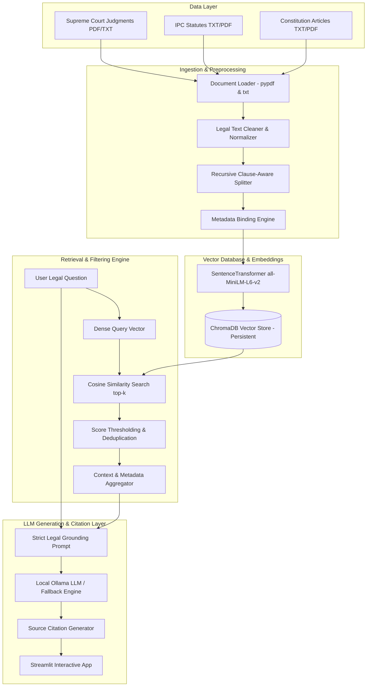

# Indian Legal RAG System — Technical Architecture & Design Document

## 1. Executive Architecture Overview

The **Indian Legal RAG System** is a enterprise-grade, offline-capable Retrieval-Augmented Generation (RAG) platform tailored for Indian legal research. It parses, embeds, indexes, and queries authentic Indian legal materials (Supreme Court Judgments, Indian Penal Code Statutes, and Constitutional Articles) to provide grounded answers accompanied by verifiable, traceable citations.



---

## 2. Component Specifications

### 2.1 Document Loader (`src/document_loader.py`)
- **Supported File Types:** `.pdf` and `.txt` documents.
- **PDF Extraction:** Built on `pypdf` for native text and metadata extraction.
- **Scanned PDF Safeguard:** Measures total extracted character count. If total text < 20 characters across all pages, flags the document as scanned/unreadable with clear OCR actionable advice rather than failing silently.
- **Header Metadata Extraction:** Parses document headers using regex patterns for fields including `Case Title`, `Issuing Authority`, `Date`, and `Source URL`.

### 2.2 Text Processing & Chunking (`src/text_processor.py`)
- **Text Cleaning:** Normalizes line breaks, collapses excessive spacing, and strips header/footer pagination while strictly preserving legal section symbols (`§`, `v.`, `AIR 1973 SC 1461`, `Section 300`).
- **Clause-Aware Splitter:** Uses `RecursiveCharacterTextSplitter` configured with legal boundary separators (`["\n\nSECTION ", "\n\nARTICLE ", "\n\nEXCEPTIONS ", "\n\n", "\n", ". "]`).
- **Hyperparameters:** `chunk_size = 800` chars, `chunk_overlap = 150` chars.
- **Metadata Binding:** Every chunk maintains parent document metadata plus `chunk_index`, `total_chunks`, and a deterministic `chunk_id` (SHA-256 hash).

### 2.3 Local Semantic Embeddings (`src/embeddings.py`)
- **Model:** `sentence-transformers/all-MiniLM-L6-v2`.
- **Vector Space:** 384 dense dimensions.
- **Execution:** 100% local CPU execution. Zero external API dependency or costs.
- **Singleton Loader:** Caches model loading in memory to optimize request latency.

### 2.4 Vector Store (`src/vector_store.py`)
- **Database:** ChromaDB persistent storage engine located in `./storage/chroma_db`.
- **Deduplication:** Verifies chunk IDs prior to insertion to prevent redundant storage.
- **Similarity Metric:** Cosine similarity mapped to a normalized score range `[0.0, 1.0]`.

### 2.5 Retrieval & Context Assembly (`src/retriever.py`)
- **Input Validation:** Rejects empty or whitespace-only queries.
- **Score Thresholding:** Drops passages with relevance scores below `DEFAULT_SCORE_THRESHOLD` (0.20).
- **Passage Deduplication:** Filters near-identical chunks before assembling the prompt context.

### 2.6 Local LLM & Citation Generator (`src/llm_service.py`, `src/citation_formatter.py`)
- **LLM Runtime:** Interfaces with local Ollama service (`http://localhost:11434`) running `llama3.2:1b`, `qwen2.5:1.5b`, or `tinyllama`.
- **Strict Grounding Prompt:** Forces the LLM to restrict answers *strictly* to retrieved passages and disclose when context is insufficient.
- **Direct Retrieval Fallback:** If Ollama is offline or model call times out, the system automatically returns an evidence-only summary with full citations, ensuring unbroken utility.
- **Traceable Citations:** Generates citations containing Case Title, Authority/Court, Date, Page Number, Relevance Match %, and Verbatim Excerpt.

---

## 3. Metadata Schema Definition

```json
{
  "document_title": "Kesavananda Bharati v. State of Kerala",
  "court_or_authority": "Supreme Court of India",
  "jurisdiction": "Constitutional Law",
  "date": "1973-04-24",
  "source_url": "https://main.sci.gov.in/judgments",
  "filename": "supreme_court_kesavananda_1973.txt",
  "file_type": "txt",
  "source_path": "d:/legal_rag/data/sample/supreme_court_kesavananda_1973.txt",
  "page_number": 1,
  "total_pages": 1,
  "chunk_index": 0,
  "total_chunks": 3,
  "chunk_id": "supreme_court_kesavananda_1973.txt_p1_c0_a1b2c3d4"
}
```

---

## 4. Failure & Resilience Matrix

| Failure Mode | Detection Mechanism | Recovery Strategy |
| :--- | :--- | :--- |
| **Scanned or Image PDF** | Text length < 20 chars across pages | Raises `DocumentLoadingError` instructing user to apply OCR |
| **Empty / Corrupt File** | 0-byte file check or parsing exception | Rejects file with informative UI & CLI error message |
| **Ollama Server Offline** | Connection error on `http://localhost:11434` | Activates Direct Retrieval Fallback Mode (returns retrieved evidence with citations) |
| **LLM Model Not Found** | HTTP 404 from Ollama API | Displays exact command to pull model (`ollama pull llama3.2:1b`) |
| **Empty Vector DB** | `collection.count() == 0` | Prompts user to ingest sample dataset or upload documents |
